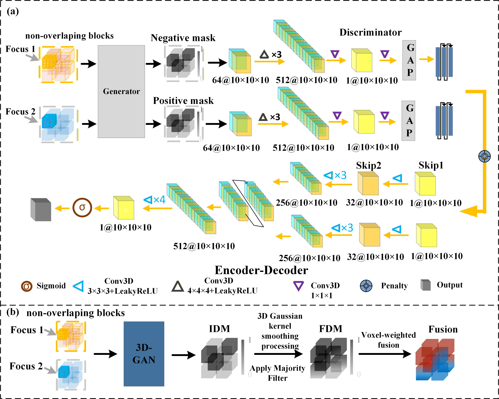
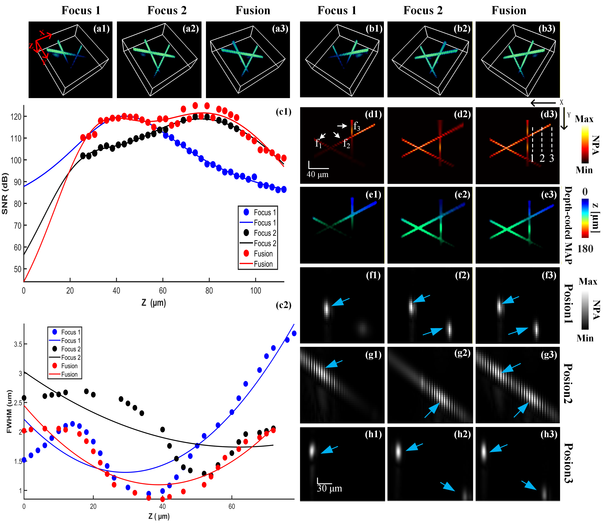

# 3D EDOF Fusion PAM WGAN

3D Extended Depth of Field Fusion for Photoacoustic Microscopy.

## System and Fusion Process

- (a) Photoacoustic microscopy imaging system
- (b) Fusion process based on volumetric information fusion

<div align="center"> </div>

## Focus Detection and Fusion Strategy

- (a) Multi-focus data acquisition
- (b) Gaussian kernel smoothing and weighted fusion

<div align="center"> </div>

## MAP Images

1. MAP images of multi-focus data before and after fusion

<div align="center"> </div>

2. Comparison of fusion results at different SNR levels

<div align="center"> </div>

## Project Structure

```
3dwgan/
├── Data/                           # Data directory
│   └── *.mat                       # Sample data files
├── fiber/                          # Fiber training data
│   ├── xianwei1/                   # Fiber sample 1
│   ├── xianwei2/                   # Fiber sample 2
│   ├── xianwei3/                   # Fiber sample 3
│   ├── xianwei4/                   # Fiber sample 4
│   └── xianwei5-response/          # Fiber sample 5 (response)
├── vessel/                         # Vessel training data
│   ├── dataGroup13_cut.mat
│   ├── dataGroup15_cut.mat
│   └── ...
├── Fusion/                         # Fusion scripts
│   ├── Fusion.py                   # Main fusion script
│   ├── Fusion_single.py           # Single image fusion
│   └── Fusion_batch.py            # Batch fusion processing
├── Scripts/                        # Scripts directory
│   ├── amira.m                    # Amira 3D visualization
│   ├── jiazao.m                   # Noise addition
│   ├── jianqie.m                  # Data cropping
│   ├── zero_one.m                 # Data normalization
│   ├── addNoise.m                 # Add noise function
│   ├── Cprocessshuang.m           # Binary file processing
│   ├── Depth_coding_JJ.m          # Depth coding
│   ├── Depth_coding_JJ_full.m     # Full depth coding
│   ├── grs2rgb.m                  # Grayscale to RGB conversion
│   ├── compare_data.py            # Compare focus and fusion data
│   └── analyze_curves.py          # Analyze NPA curves
├── requirements.txt                # Python dependencies
└── README.md                       # This file
```

## Training Data

### Fiber Data (`fiber/`)

| Directory | Description | Focus Positions |
|-----------|-------------|-----------------|
| `xianwei1/` | Fiber sample 1 | z=35, z=60 |
| `xianwei2/` | Fiber sample 2 | Multiple SNR levels (0, 15, 20, 25, 30, 35) |
| `xianwei3/` | Fiber sample 3 | z=40, z=70 |
| `xianwei4/` | Fiber sample 4 | z=35, z=40, z=65, z=70 |
| `xianwei5-response/` | Fiber sample 5 (response test) | - |

### Vessel Data (`vessel/`)

| File | Description |
|------|-------------|
| `dataGroup13_cut.mat` | Vessel group 13 |
| `dataGroup15_cut.mat` | Vessel group 15 |
| `dataGroup16_cut.mat` | Vessel group 16 |
| `dataGroup17_cut.mat` | Vessel group 17 |
| `dataGroup18_cut.mat` | Vessel group 18 |
| `dataGroup19_cut.mat` | Vessel group 19 |
| `dataGroup30_cut.mat` | Vessel group 30 |
| `dataGroup34_cut.mat` | Vessel group 34 |
| `dataGroup40_cut.mat` | Vessel group 40 |
| `dataGroup41_cut.mat` | Vessel group 41 |
| `dataGroup44_cut.mat` | Vessel group 44 |
| `dataGroup145_cut.mat` | Vessel group 145 |
| `dataGroup323_cut.mat` | Vessel group 323 |

## Installation

```bash
pip install -r requirements.txt
```

## Usage

### Single Image Fusion

```bash
python Fusion/Fusion_single.py
```

### Batch Fusion Processing

```bash
python Fusion/Fusion_batch.py
```

### Data Analysis

```bash
python Scripts/compare_data.py
python Scripts/analyze_curves.py
```

## Algorithm

The fusion algorithm uses:
1. Gaussian kernel smoothing for decision map refinement
2. Weighted fusion based on decision map values

## Parameters

- `sigma`: Gaussian kernel standard deviation (default: 8)
- `radius`: Gaussian kernel radius (default: 2)
- `n`: Block size parameter (default: 5)

## Scripts

### MATLAB Scripts

- `amira.m`: Export 3D data to Amira format (.raw files)
- `jiazao.m`: Add noise to data with different SNR levels
- `jianqie.m`: Data cropping utilities
- `zero_one.m`: Data normalization to [0, 1] range
- `addNoise.m`: Add noise function
- `Cprocessshuang.m`: Process binary files for maximum amplitude projections
- `Depth_coding_JJ.m`: Depth information encoding
- `Depth_coding_JJ_full.m`: Full depth coding with RGB output
- `grs2rgb.m`: Convert grayscale images to RGB using colormap

### Python Scripts

- `compare_data.py`: Compare focus and fusion data, calculate FWHM
- `analyze_curves.py`: Analyze and visualize NPA curves

## Data Format

- Input data: `.mat` files containing 3D volume data
- Focus positions: z=35, z=40, z=60, z=65, z=70
- SNR levels: 0, 15, 20, 25, 30, 35

## Output

- Fused 3D volume data in `.mat` format
- Maximum projection images in `.png` format
- Curve analysis plots
